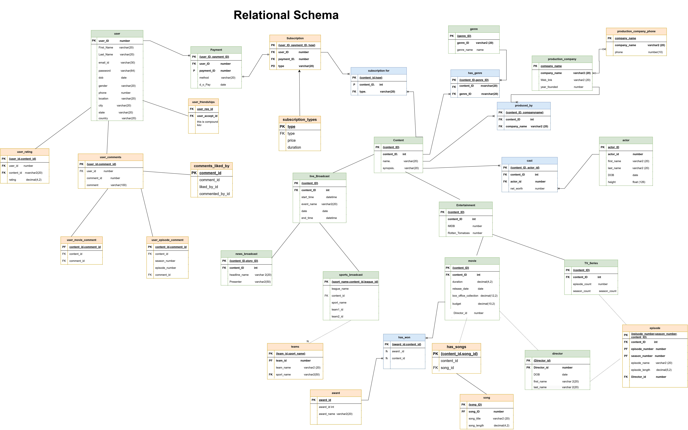

# OTT Platform Database Project

## Problem Statement  
This project introduces a comprehensive OTT platform database aimed at enhancing user experience by providing insights beyond basic content. While typical OTT databases focus on storing user data and available content, this project goes further by incorporating features like diverse subscription models, multiple payment methods, user-driven ratings, and social interactions to foster a vibrant user community.

## Overview  
An OTT (Over-The-Top) platform delivers digital content directly to consumers over the internet, bypassing traditional broadcasting outlets. This project database captures and organizes extensive details, focusing on key aspects that optimize content curation, subscription models, and user engagement.

## Key Features

1. **Subscription Models**
   - The database tracks multiple subscription models tailored to each user's preferences, providing flexibility and transparency in pricing and content access.

2. **Content Library**
   - Comprehensive content coverage, including movies, TV shows, live sports broadcasts, and news channels.
   - Content is curated based on various parameters to maximize engagement and cater to user interests.

3. **Rating System**
   - User ratings and feedback on various programs are stored.
   - Aggregates scores from credited websites like IMDb, Rotten Tomatoes, and Metacritic to provide trusted reviews for users.

4. **Interactive Forum**
   - A unique forum where users can share opinions on different programs, rate content, and discuss trending topics.
   - Likes and interactions on comments are stored to enhance community engagement.

5. **Social Connections**
   - Users can make "friends" within the platform, fostering a social environment where they can view each other's ratings, reviews, and interests.

## Database Structure

### Tables Included:
- **Users**: Stores user profile information, subscription details, and payment preferences.
- **Content**: Houses details of movies, shows, live broadcasts, and news, along with genre, rating, and accreditation scores.
- **Ratings**: Contains user-generated ratings, reviews, and aggregated ratings from external sources.
- **Subscriptions**: Manages various subscription models, including their cost and benefits.
- **Forum**: Stores user comments, likes, and discussion threads on various content.
- **Friends**: Facilitates the connection between users and maintains information about friendships.

## Technologies Used
- **Database**: Oracle SQL

## Schema

